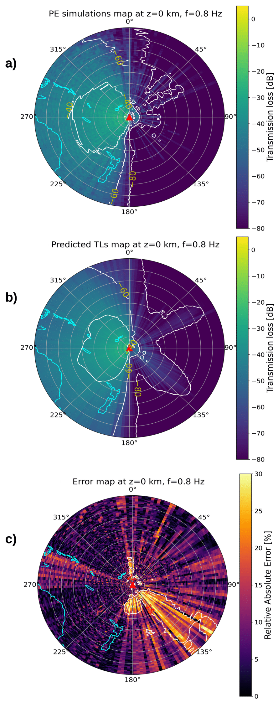

## DeepLearning_Infrasound
Towards real-time assessment of infrasound event detection capability using deep learning-based transmission loss estimation

## Summary
We provide a convolutional recurrent neural network estimating in near real-time ground-level infrasound transmission loss (TL) of a given frequency over 4,000 km. It uses as inputs realistic range-dependent atmospheric specifications combining horizontal wind speed and temperature values. The network can be used as a tool for near real-time estimation of infrasound event detection capability at a global scale or for the study of regional events, like the Tonga-Hunga Ha'apai volcano eruption on January 15, 2022.

Figure: (from ...) Simulated and predicted TL maps of infrasound generated by the eruption of the Tonga-Hunga Ha'apai volcano (panels a) and b)) and point-by-point relative absolute error in percentage (panel c)) at 0.8 Hz. 

## Requirements
- cuda 11.7
- cudnn 8.6.0
- python 3/3.10.6
- tensorflow 2.8.3
- keras 2.8.0

Also see «cnn_gru/requirements.txt»

## Usage
All code files have a header with a quick description describing the usage. 
To understand the underlying theory, please read the associated publication.

To test the pre-trained model, run the code contained in «cnn_gru/main.py».
A condensed version of the code is shown in the jupyter notebook «cnn_gru/quick_test.ipynb».

Please cite us if you procude results using the code, as shown in "CITATION.cff".

Contact us with any questions (alice.cameijo@cea.fr)

## Data
The realistic range-dependent atmospheric models input data are obtained using the 6th version of the Whole Atmosphere Community Climate Model forecast products (Atmospheric Chemistry Observations & modeling, National Center for Atmospheric Research, University Corporation for Atmospheric Research, accessed 01 July 2024, https://doi.org/10.5065/G643-Z138, [Gettelman et al., 2019]).

The parabolic equation simulation-based output data are obtained thanks to the « ePape » modeling tool from the National Center for Physical Acoustics (University of Mississippi, [Waxler et al., 2021]).

Both input and output data have been pre-processed in order to feed the convolutional recurrent neural network. It is possible to re-create a dataset using the Whole Atmosphere Community Climate Model product, the "ePape" solver, and the pre-processing code files «Data/Preprocessing/inputs.py» and «Data/Preprocessing/outputs.py».

## Associated publication 
http:·...

"Towards real-time assessment of infrasound event detection capability using deep learning-based transmission loss estimation"

Accurate modeling of infrasound transmission loss is essential for evaluating the performance of the International Monitoring System network, which monitors compliance with the Comprehensive Nuclear Test-Ban Treaty. Among existing propagation modeling tools, the parabolic equation method enables transmission loss to be finely simulated using wind and temperature atmospheric models. However, its computational cost prohibits the exploration of a large parameter space in operational monitoring applications. To address this, a recent study exploited a deep learning algorithm capable of making ground-level loss predictions almost instantaneously, similar to parabolic equation-based outputs. However, this relied on interpolated atmospheric models, leading to an incomplete representation of the medium, and did not use the temperature as part of the inputs, which makes the network not adapted for long range propagation. In the current work, we address these limitations by using both wind and temperature fields as input, simulated up to 130 km altitude and 4,000 km distance. We also optimize several aspects of the network architecture. We exploit convolutional and recurrent layers to capture spatially and range-dependent features embedded in realistic atmospheric data, improving the overall performance. The network reaches an average error of 4 dB compared to full parabolic equation simulations and provides epistemic and data-related uncertainty estimates. Its evaluation on the 2022 Tonga-Hunga Ha'apai volcanic eruption demonstrates its generalization capabilities. The model adapts to a broad range of frequencies not included in the training, marking a significant step towards near real-time assessment of International Monitoring System detection thresholds of explosive sources.

## Other references
Gettelman, A., Mills, M. J., Kinnison, D. E., Garcia, R. R., Smith, A. K., Marsh, D. R., ... & Randel, W. J. (2019). The whole atmosphere community climate model version 6 (WACCM6). Journal of Geophysical Research: Atmospheres, 124(23), 12380-12403.

Waxler, R., Hetzer, C., Assink, J., & Velea, D. (2021). Chetzer-ncpa/ncpaprop-release: NCPAprop v2. 1.0 (v2. 1.0). Zenodo.
